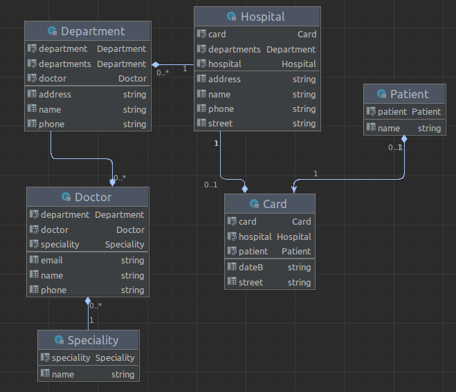

# Iliasov Mykola Ks-34
Hospital app

## HTTP Verbs
| HTTP METHOD | URL                    | Payload | Description            |
|-------------|------------------------|---------|------------------------|
| GET         | /hospitals             | {}      | all hospitals          |
| POST        | /hospitals/new         | {}      | create new hospital    |
| UPDATE      | /hospitals/:id/edit    | {}      | update hospital        |
| DELETE      | /hospitals/:id         | {}      | destroy hospital       |
| GET         | /departments           | {}      | all departments        |
| POST        | /departments/new       | {}      | create new department  |
| UPDATE      | /departments/:id/edit  | {}      | update department      |
| DELETE      | /departments/:id       | {}      | destroy department     |
| GET         | /cards                 | {}      | all cards              |
| POST        | /cards/new             | {}      | create new card        |
| UPDATE      | /cards/:id/edit        | {}      | update card            |
| DELETE      | /cards/:id             | {}      | destroy card           |
| GET         | /patients              | {}      | all patients           |
| POST        | /patients/new          | {}      | create new patient     |
| UPDATE      | /patients/:id/edit     | {}      | update patient         |
| DELETE      | /patients/:id          | {}      | destroy patient        |
| GET         | /doctors               | {}      | all doctors            |
| POST        | /doctors/new           | {}      | create new doctor      |
| UPDATE      | /doctors/:id/edit      | {}      | update doctor          |
| DELETE      | /doctors/:id           | {}      | destroy doctor         |
| GET         | /specialities          | {}      | all specialities       |
| POST        | /specialities/new      | {}      | create new specialities|
| UPDATE      | /specialities/:id/edit | {}      | update specialities    |
| DELETE      | /specialities/:id      | {}      | destroy specialities   |

## ERD diagram

### Labs

- [х] Task 1 -> Rails додаток Клініки (поля на вибір), Відділення (поля на вибір. Клініка може мати відділення), Лікарі (поля на вибір. Відділення може мати лікарів), Спеціальність (поля на вибір. Лікар може мати 1 спеціальність), Карта пацієнта (поля на вибір) У таблиці може бути багато карт), Пацієнти (поля на вибір У карті може бути 1 пацієнт).
- [х] Task 2 -> Вставити 100 записів у наші таблиці. У кожній групі по 6 таблиць в 3 таблиці зробити методи, які будуть обгорткою на чистому SQL. У 3 таблиці просто на ОРМ. У кожній моделі повинні бути методи на оновлення. В 3 таблиці зробити методи, які будуть обгорткою на чистому SQL. У 3 таблиці просто на ОРМ. Зробити по 2 SQL VIEW.
- [х] Task 3 -> Зробити CRUD форми під кожну модель.
- [х] Task 4 -> Додати гем Devise до вашого веб застосунку (повинна бути можливість зареєструватись/залогінитись/востановити пароль). Додати тести. Додати CSS/JS 🌞.
- [х] Task 5 -> Зробити root_page (наповнення яке завгодно але повинне бути посилання на вхід/реєстрацію). Пропрацювати інформацію про лікарні, бібліотеки (треба додати назву, рік створення). Створити таблиці як на зображені (кожна таблиця повинна мати пагінацію, якщо ви бачите поля "number of ... " то так це кількість моделей в асоціації 🙂 не треба створвати поле треба його порахувати) (додати CSS) . Створити сторінки під кожну модель. Додати логіку під Пошук та Сортування. Створити це за допомогою QueryObject. Додати тести під кожний елемент.
- [х] Task 6 -> Зробити rake задачу котра буде парсити сайт та додавати у вашу БД назву лікарні або бібліотеки.
- [х] Task 7 -> Додати поля (type, city, RatingMortality) у лікарні, додати CSV файл до додатка (наразі просто у папку його покладіть). Розпарсить файл та зберігти дані за допомогою rake задачі.
- [х] Task 8 -> Додати можливість завантажувати 2 файла (СSV, PDF). СSV: в одному файлі всі ваши бібліотеки або ліукарні та читачи/хворі які є в лікарні або бібліотеки (це повинно бути в одному файлі). PDF (може бути декілька файлів): 1) інформація про  всі ваши бібліотеки або ліукарні та читачи/хворі які є в лікарні або бібліотеки (це повинно бути в одному файлі) 2) інформація про кожну окрему бібліотеку (додаті кольори та зображення) 3) інформація про кожного користовача  (додаті кольори).